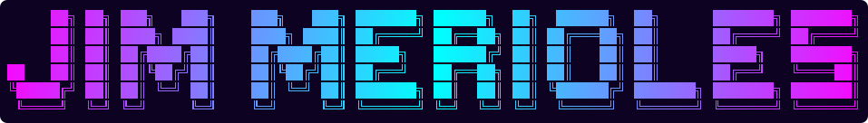

# name-ascii-art

My name (`jimmerioles`) rendered as ASCII art.



<details>
<summary>Plain text version</summary>

```
     ██╗ ██╗ ███╗   ███╗    ███╗   ███╗ ███████╗ ██████╗  ██╗  ██████╗  ██╗      ███████╗ ███████╗
     ██║ ██║ ████╗ ████║    ████╗ ████║ ██╔════╝ ██╔══██╗ ██║ ██╔═══██╗ ██║      ██╔════╝ ██╔════╝
     ██║ ██║ ██╔████╔██║    ██╔████╔██║ █████╗   ██████╔╝ ██║ ██║   ██║ ██║      █████╗   ███████╗
██   ██║ ██║ ██║╚██╔╝██║    ██║╚██╔╝██║ ██╔══╝   ██╔══██╗ ██║ ██║   ██║ ██║      ██╔══╝   ╚════██║
╚█████╔╝ ██║ ██║ ╚═╝ ██║    ██║ ╚═╝ ██║ ███████╗ ██║  ██║ ██║ ╚██████╔╝ ███████╗ ███████╗ ███████║
 ╚════╝  ╚═╝ ╚═╝     ╚═╝    ╚═╝     ╚═╝ ╚══════╝ ╚═╝  ╚═╝ ╚═╝  ╚═════╝  ╚══════╝ ╚══════╝ ╚══════╝
```

</details>

## Why this exists

I made this by hand because the available tools can't fix character spacing.
The default ANSI Shadow output crams the letters together — it looks cramped and
not elegant. So the art here has manually widened gaps between characters to give
it breathing room. Any regenerated output from the tools below will be cramped by
default and needs the spacing tuned manually again.

## What's here

| File | Purpose |
| --- | --- |
| `jimmerioles.txt` | The art itself, plain text (no color codes), ANSI Shadow font |
| `jimmerioles-cyberpunk.svg` | The colored version shown above, generated from `jimmerioles.txt` |
| `package.json` / `bun.lock` | Keeps the generator tool [`cli-ascii-logo`](https://www.npmjs.com/package/cli-ascii-logo) pinned |
| `node_modules/` | Installed deps (gitignored) |

## Colored version (SVG)

GitHub strips ANSI colors from code blocks, so the color in this README comes from
an SVG: `jimmerioles-cyberpunk.svg`. It draws `jimmerioles.txt` as SVG `<text>`
with a linear gradient over a dark `#0d0221` background.

- Gradient (cyberpunk): `#ff00ff` → `#00ffff` → `#ff00ff` (magenta → cyan → magenta)
- Monospace font with `xml:space="preserve"` so the hand-tuned spacing survives

To update: edit `jimmerioles.txt` first, then ask the agent to regenerate the SVG
from it. Don't hand-edit the SVG — the spacing source of truth is the `.txt`.

## Requirements

- [Bun](https://bun.sh) (lockfile is `bun.lock`)

```bash
bun install
bunx cli-ascii-logo --help
```

## Regenerating the art

`cli-ascii-logo` outputs a gradient-colored version using the ANSI Shadow font.
Treat it as a starting point only: the raw output is cramped, so the saved art has
extra spaces inserted between characters (and words) to spread it out.

```bash
# Preview a colored version (default palette: sunset)
bunx cli-ascii-logo "jimmerioles"

# Pick a palette
bunx cli-ascii-logo "jimmerioles" -p gold
bunx cli-ascii-logo "jimmerioles" -p cyberpunk

# Random palette
bunx cli-ascii-logo "jimmerioles" --random

# List every palette
bunx cli-ascii-logo --list
```

Palettes: `sunset`, `ocean`, `fire`, `forest`, `gold`, `copper`, `blue`, `mint`,
`aqua`, `ice`, `dawn`, `lava`, `volcano`, `coral`, `cherry`, `cyberpunk`, `neon`,
`aurora`, `lavender`, `emerald`, `matrix`, `nebula`, `cristal`, `teen`, `mind`,
`morning`, `vice`, `passion`, `fruit`, `instagram`, `atlas`, `retro`, `summer`,
`pastel`, `rainbow`.

### Saving a colored version

```bash
bunx cli-ascii-logo "jimmerioles" -p gold > jimmerioles-colored.txt
```

### Saving plain text

Strip the ANSI color codes before saving, then widen the spacing by hand:

```bash
bunx cli-ascii-logo "jimmerioles" -p gold | sed 's/\x1b\[[0-9;]*m//g' > jimmerioles.txt
```

### Plain ASCII without the extra tool

`figlet` is already pulled in by `cli-ascii-logo`:

```bash
bunx figlet -f "ANSI Shadow" jimmerioles
```

## Editing tips for future me

- **Don't space it by hand — prompt the agent to do it.** Give the agent the raw tool output and ask it to widen the gaps evenly across all 6 lines and verify the columns line up. Example prompt: *"Take this ANSI Shadow output and add spacing between the letters and words so it looks elegant, keeping every line aligned."* The agent can iterate and diff the result far faster than manual editing.
- Use a monospace font. Box-drawing chars (`█ ╗ ╔ ╚ ╝ ═ ║`) are one cell wide; proportional fonts break alignment.
- Spacing is the whole point of this repo: add a column of spaces between letters and a wider gap between words until it looks elegant. Add the same number of spaces at the same positions on every one of the 6 lines or the rows will shear.
- Never mix tabs and spaces; the art is space-aligned.
- Keep the file's internal blank lines/leading spaces intact so the columns line up.
- If a file looks wrong in a terminal but fine elsewhere, check for hidden ANSI codes:
  `cat -v file.txt` or `less -R file.txt`.
- If the name changes, regenerate all lines in one go — hand-editing one letter tends to shift the rest of the row.
- Terminal must be wide enough (~100+ cols) or lines will wrap.
